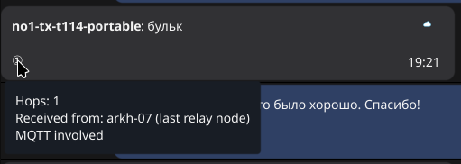
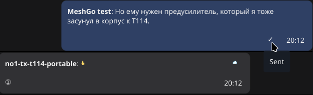
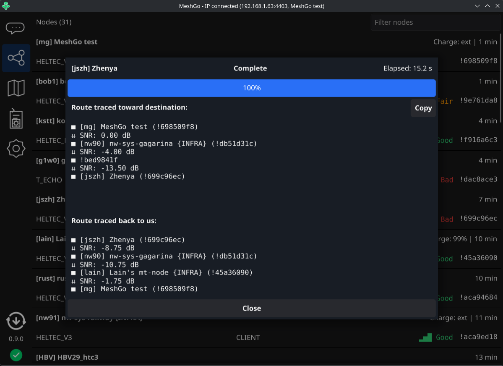
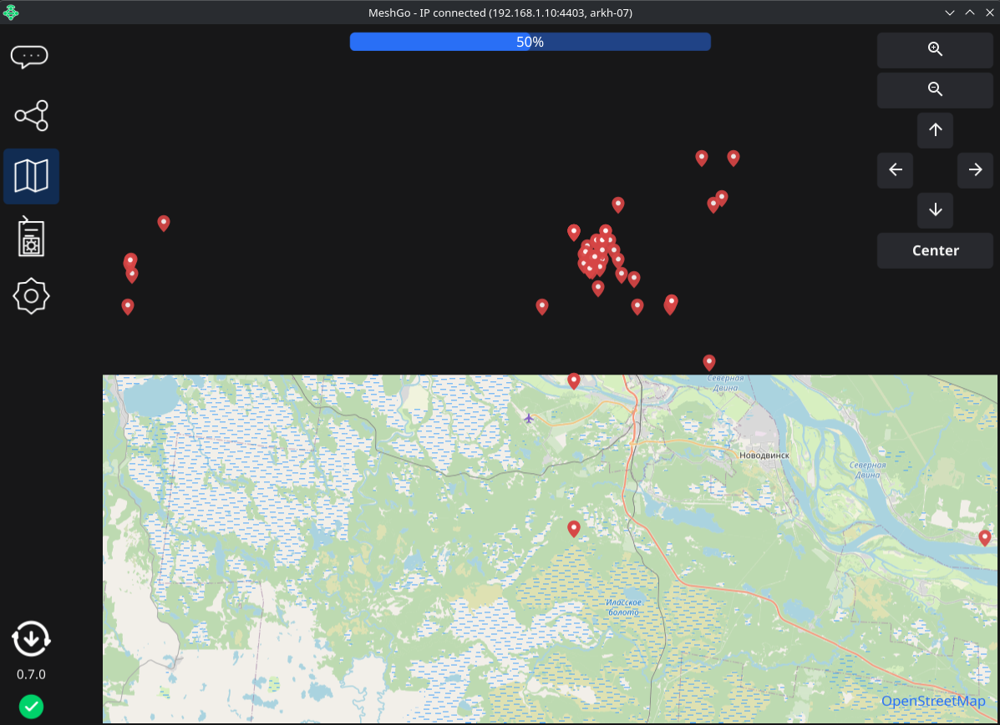
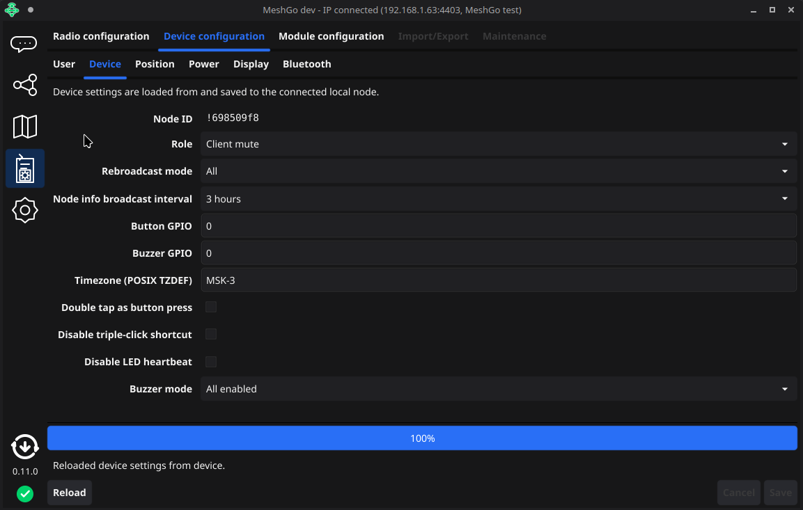

# MeshGo

MeshGo is a desktop client for Meshtastic networks.

It focuses on a practical GUI for connecting to nodes, browsing network data, and interacting with messages.

Check [Releases](https://git.skobk.in/skobkin/meshgo/releases) section for latest downloads available.

> [!NOTE]
> Releases are hosted on my private [Forgejo](https://en.wikipedia.org/wiki/Forgejo) instance,
> Github is used only to mirror the source code for better availability.

## Screenshots

Chat view

Node list

Map view

Node settings

App settings

Update dialog

