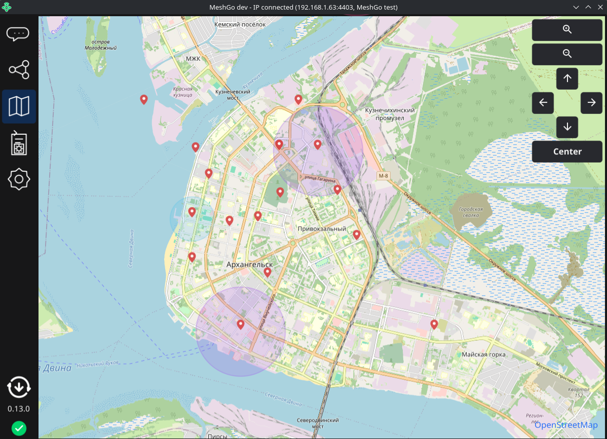
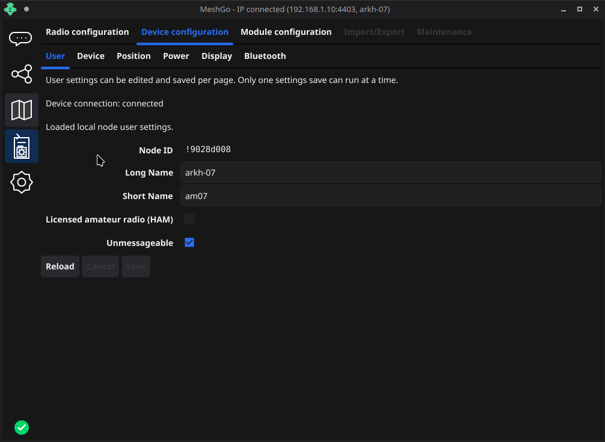
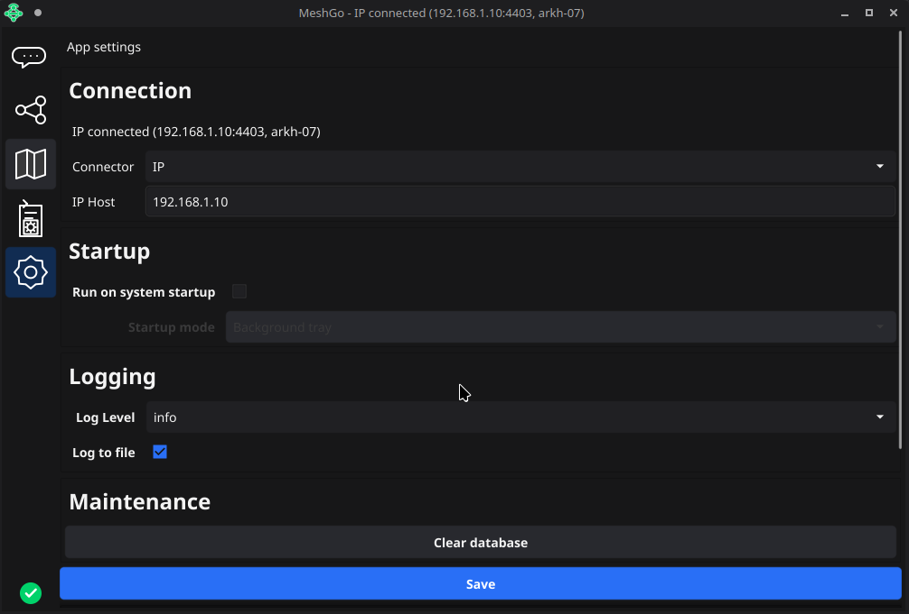
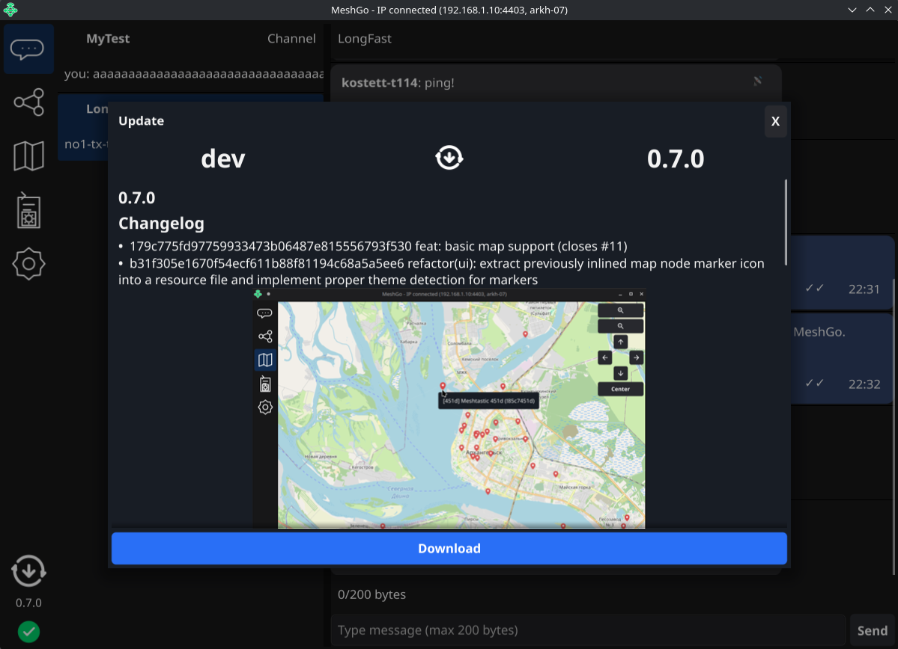

# MeshGo

MeshGo is a desktop client for Meshtastic networks.

It focuses on a practical GUI for connecting to nodes, browsing network data, and interacting with messages.

## Download

Check [Releases](https://git.skobk.in/skobkin/meshgo/releases) section for latest downloads available.

## Screenshots

Node list

Map view

Node User settings

App settings

Update dialog

