# MeshGo

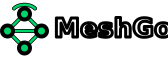

MeshGo is a desktop client for Meshtastic networks.

It focuses on a practical GUI for connecting to nodes, browsing network data, and interacting with messages.

Check [Releases](https://git.skobk.in/skobkin/meshgo/releases) section for latest downloads available.

> [!NOTE]
> Releases are hosted on my private [Forgejo](https://en.wikipedia.org/wiki/Forgejo) instance,
> Github is used only to mirror the source code for better availability.

## Screenshots

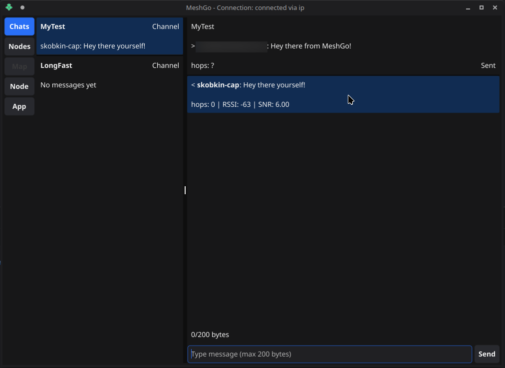

Chat view

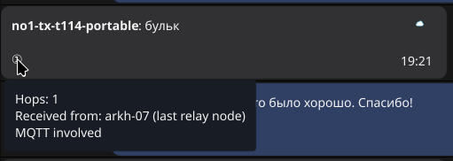

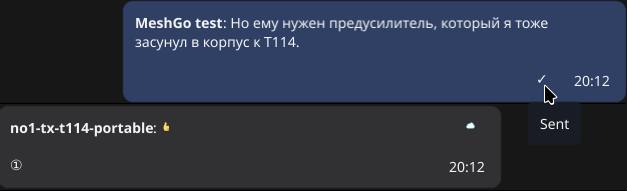

Node list

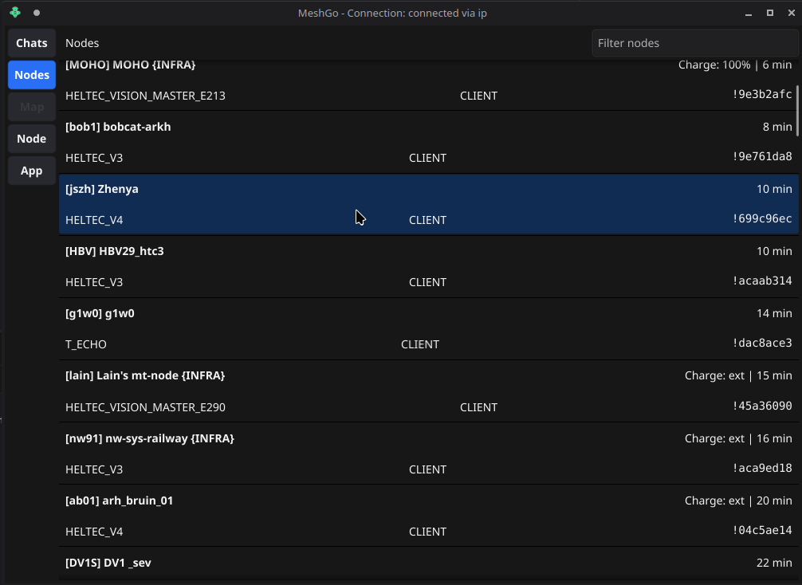

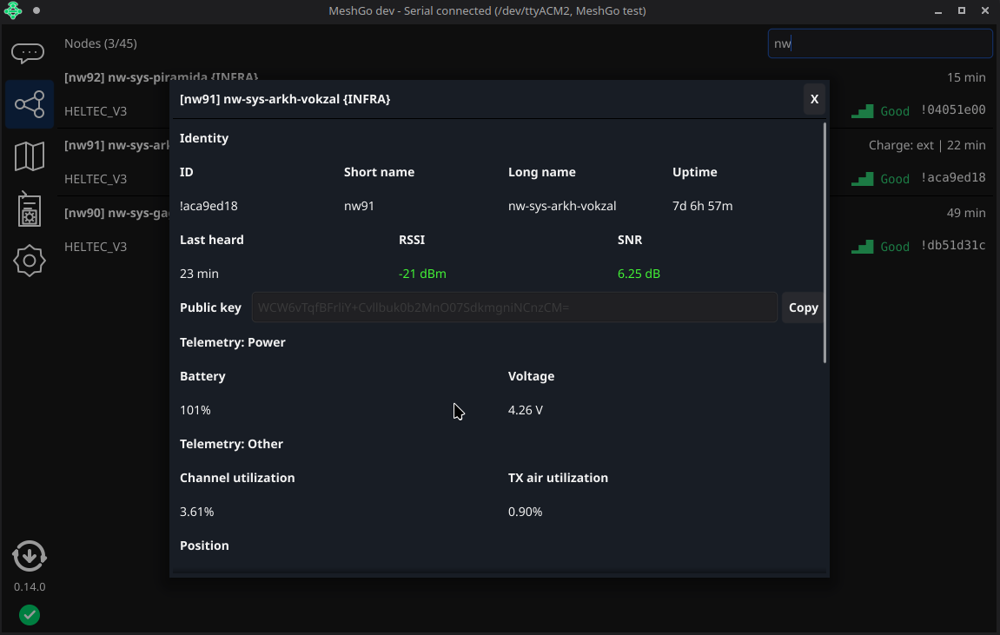

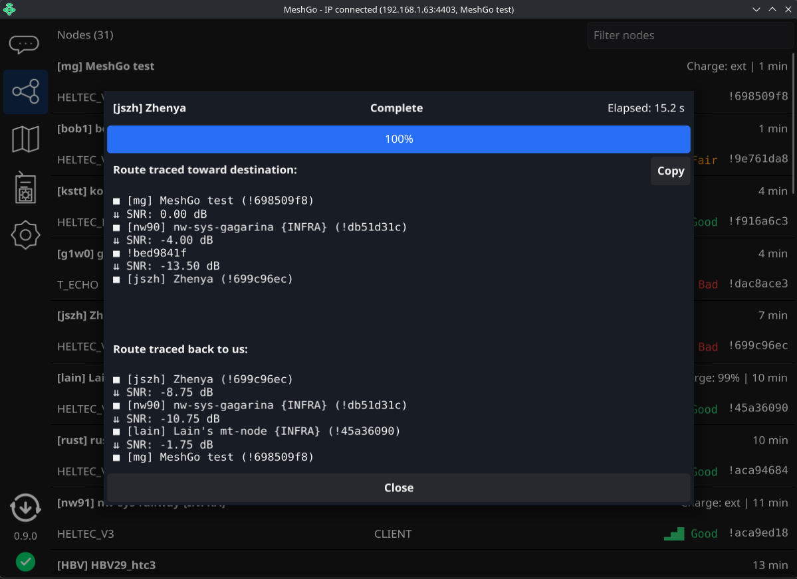

Map view

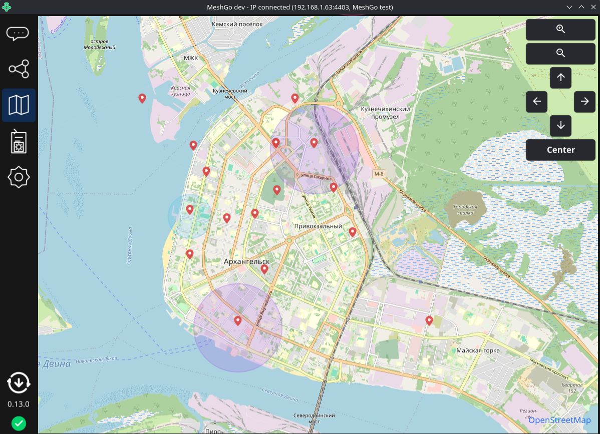

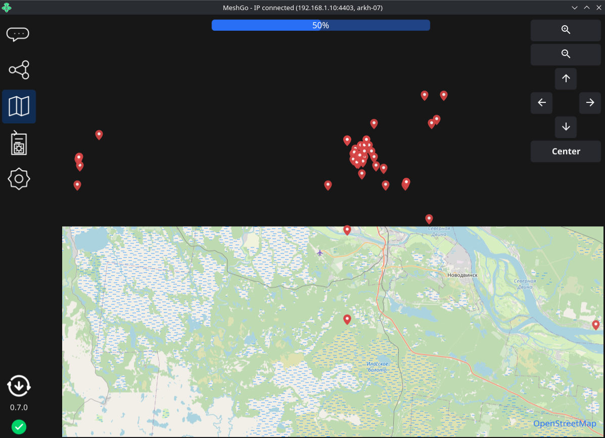

Node settings

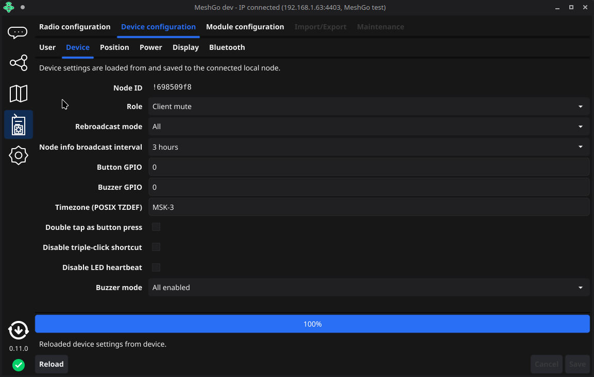

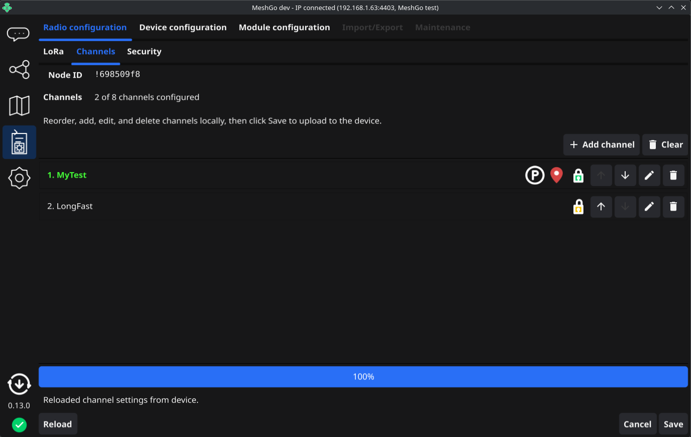

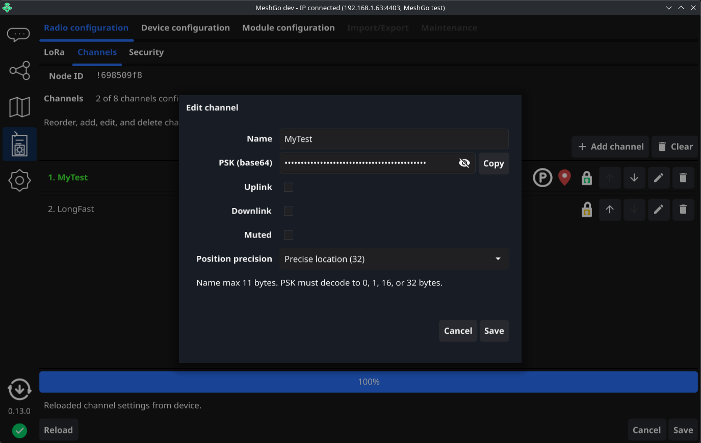

App settings

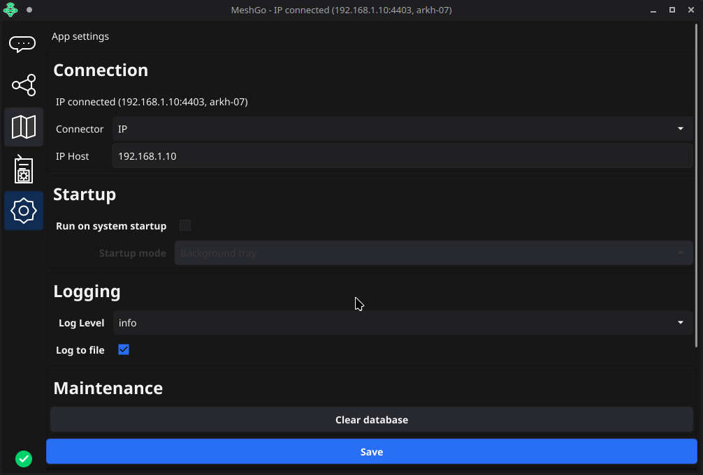

Update dialog

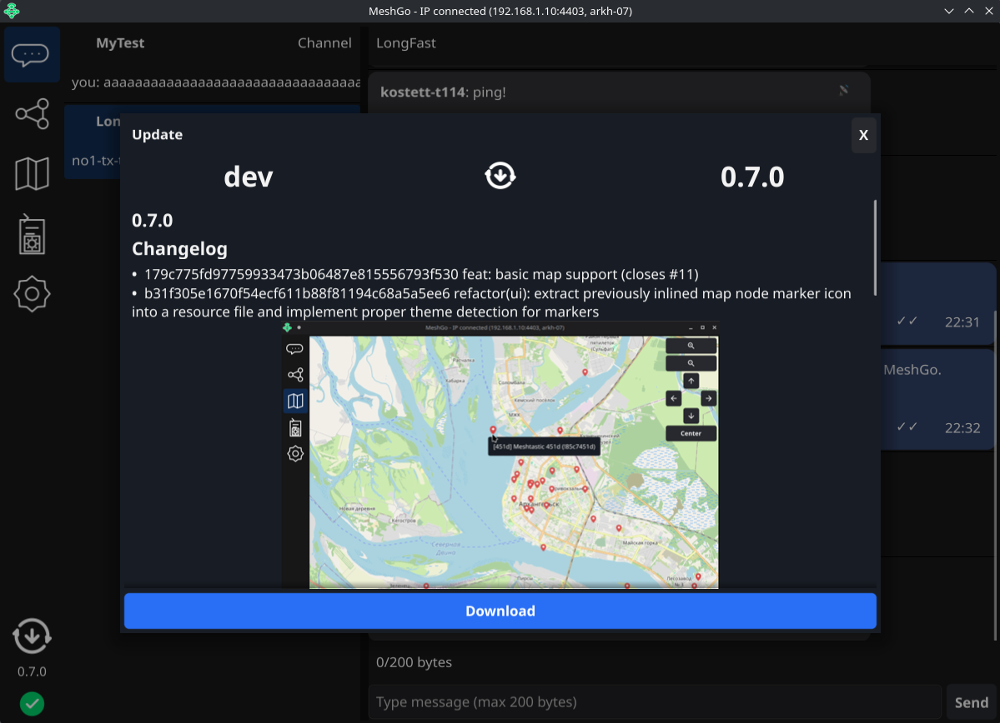

## License

MeshGo's original source code is licensed under MIT unless otherwise noted.

The generated Meshtastic protobuf bindings in `internal/radio/meshtasticpb/`
are generated from Meshtastic protobuf schemas from
[`meshtastic/protobufs`](https://github.com/meshtastic/protobufs), which
are licensed under GPL-3.0. These generated files are kept separate from
MeshGo's original code. See [`THIRD_PARTY_NOTICES.md`](THIRD_PARTY_NOTICES.md)
for details and the upstream license reference.
